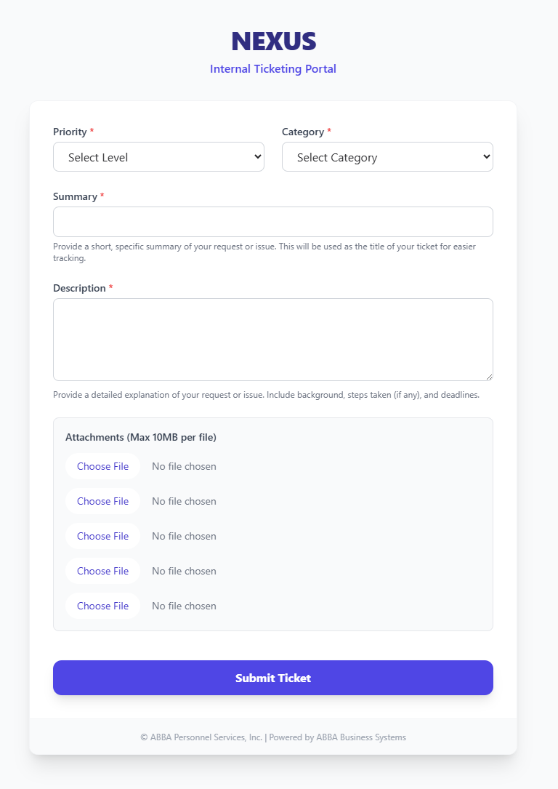
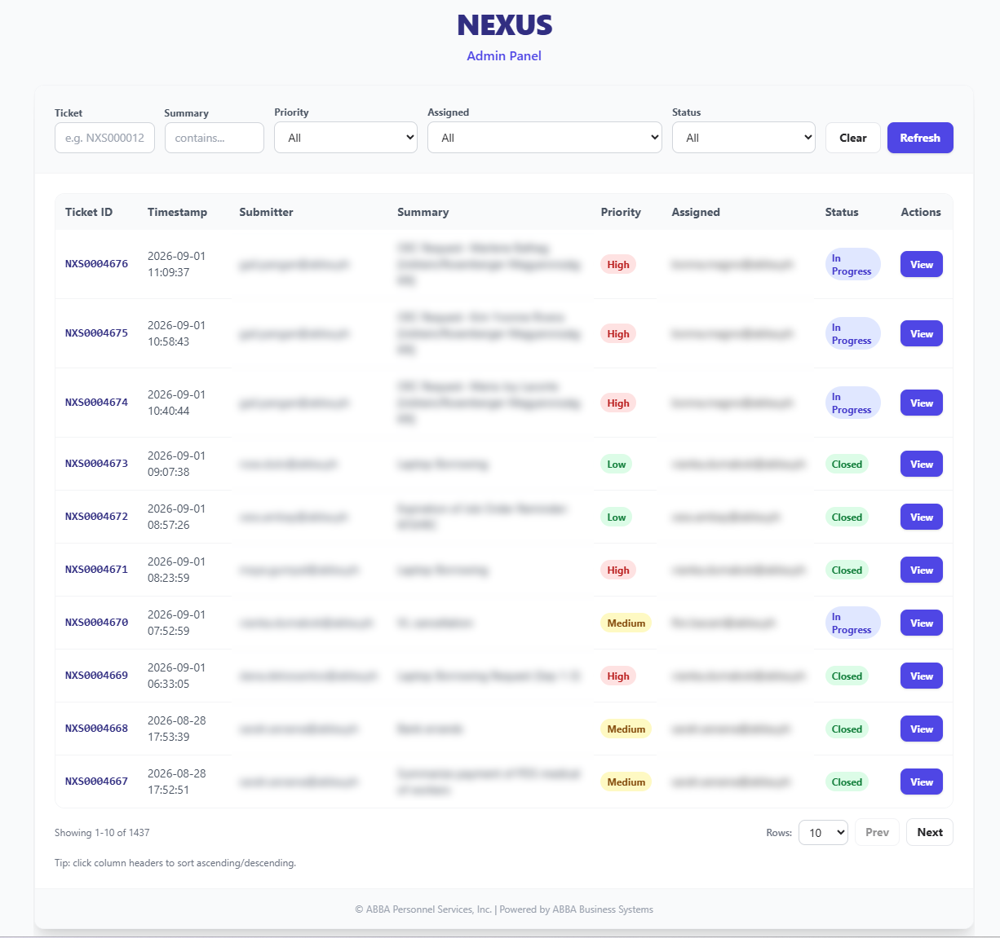
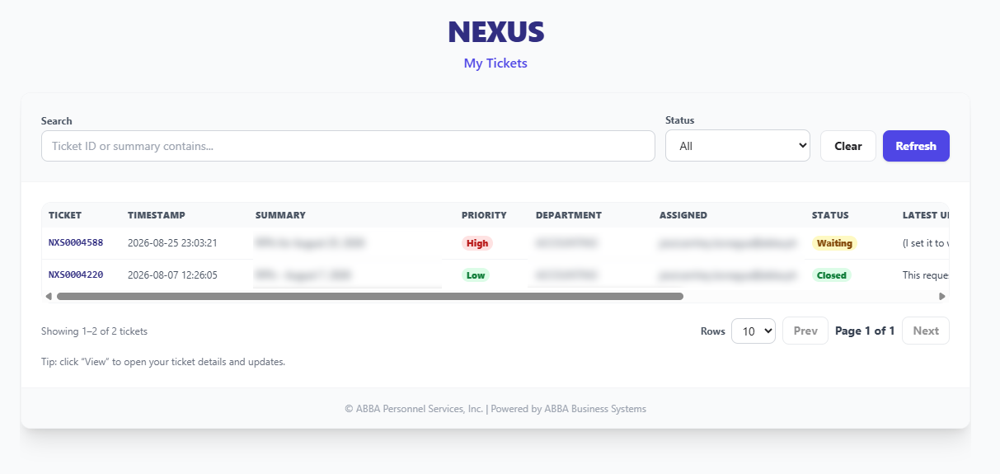
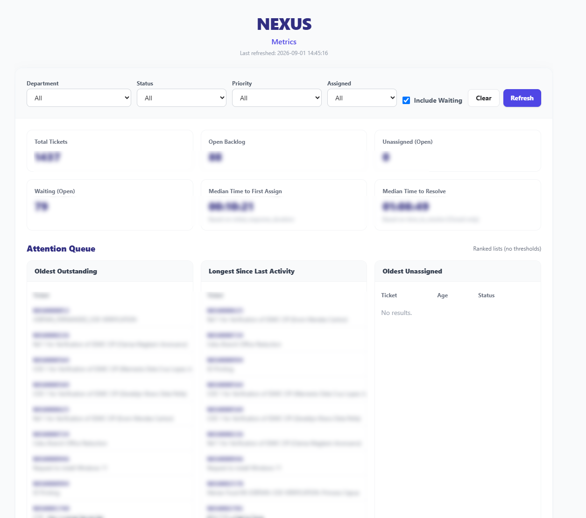
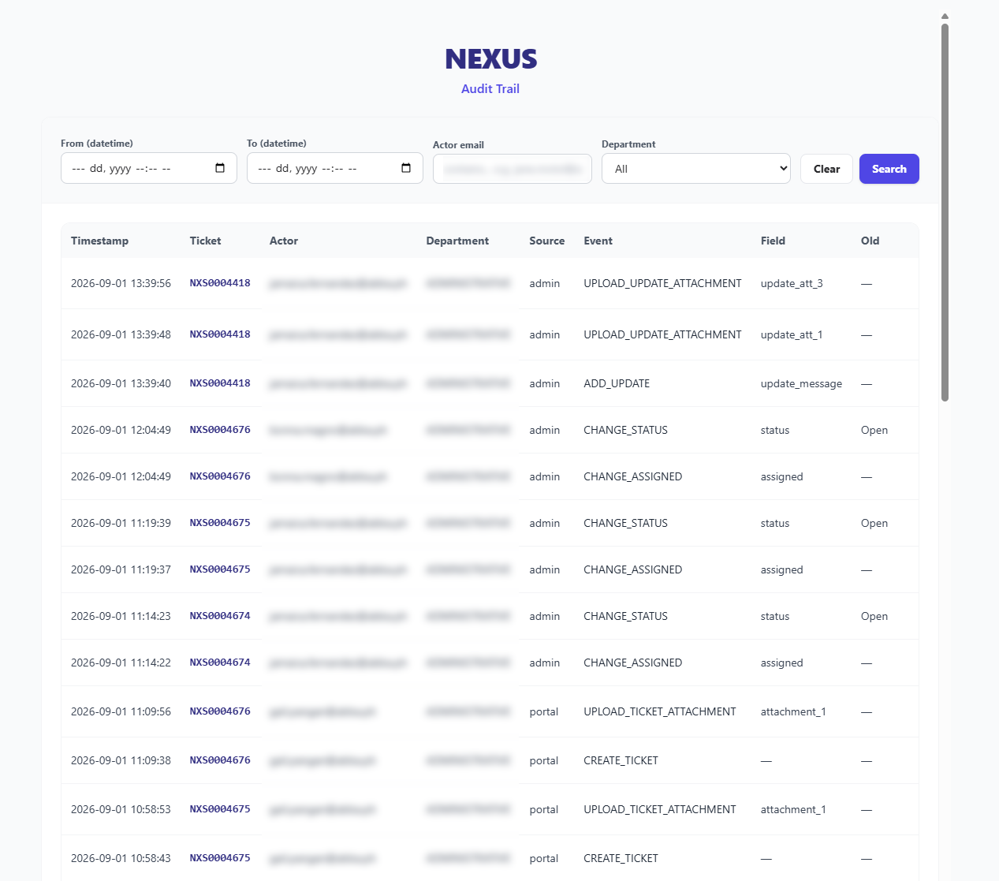
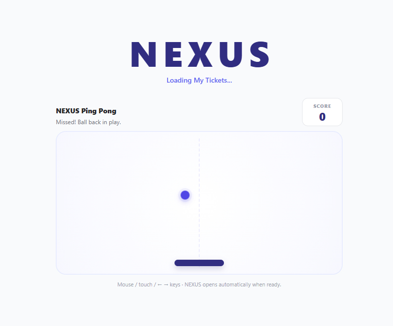

# NEXUS

NEXUS is an internal support management system built to centralize employee requests, route tickets to the appropriate team, track ownership and status changes, preserve an audit trail, and surface operational metrics.

It was designed as a practical business system rather than a standalone demo. The public version in this repository has been sanitized to remove company-specific identities, addresses, identifiers, and internal configuration.

## Interface Preview

### Ticket Submission
Employees can submit requests, choose a category and priority, provide supporting details, and attach files.



### Admin Panel
Authorized team members can filter tickets, review ownership and status, and open individual records for further action.



### My Tickets
Requesters can review their own tickets, monitor progress, and open ticket details and update threads.



### Metrics
Operational metrics surface ticket volume, backlog, response and resolution timing, attention queues, and team activity.



### Audit Trail
The audit interface records system activity such as ticket creation, assignment changes, status changes, updates, and attachments.



### NEXUS Ping Pong
A lightweight loading experience built into selected NEXUS views while application data is loading.



## What it does

- Creates and tracks support tickets with unique IDs
- Routes requests by department and category
- Supports priority, assignment, status, and waiting-state workflows
- Allows requesters and administrators to post threaded updates
- Supports ticket and update attachments
- Sends email notifications for submissions, updates, and resolution
- Enforces role-based access and department-level ticket visibility
- Records an append-only audit trail for key actions and field changes
- Tracks response and resolution timing
- Provides an operational metrics dashboard and attention queues
- Includes a lightweight NEXUS Ping Pong loading experience for longer page loads

## Main interfaces

**Ticket Portal**  
Employees submit requests, select a category and priority, attach supporting files, and receive a ticket ID.

**My Tickets**  
Requesters can review their own tickets, view status changes, read the update thread, and post follow-up information.

**Admin Panel**  
Authorized team members can manage assigned tickets, update status, post responses, upload attachments, and review timing information.

**Audit Trail**  
Super administrators can review recorded system events, field changes, actors, timestamps, and supporting metadata.

**Metrics**  
Authorized users can review ticket volume, backlog, response and resolution timing, attention queues, and team-level operational activity.

## Workflow

```text
Employee Request
      ↓
Ticket Creation
      ↓
Department Routing
      ↓
Assignment & Status Management
      ↓
Updates / Attachments / Notifications
      ↓
Resolution
      ↓
Audit Trail & Operational Metrics
```

## Architecture

```text
User Interface
      ↓
Google Apps Script Backend
      ↓
Data Persistence Layer
      ↓
Workflow / Notification Engine
```

The backend handles access control, ticket generation, workflow rules, attachment handling, email notifications, timing calculations, audit logging, and reporting logic.

## Technology

**Google Apps Script • JavaScript • HTML/CSS • Tailwind CSS • Workflow Automation • Role-Based Access • Email Notifications • File Handling • Reporting & Analytics**

## Access model

NEXUS uses server-side access checks rather than relying only on interface visibility.

- Regular users can access their own tickets.
- Team members can manage tickets within their assigned department.
- Super administrators can access all departments and the audit trail.
- Assignment options are constrained by department.
- Ticket ownership and department scope are validated on the backend.

## Operational logic

NEXUS tracks several workflow events beyond basic ticket status changes, including:

- first assignment
- automatic movement from **Open** to **In Progress** on first assignment
- waiting periods
- accumulated waiting time
- time to resolution excluding recorded waiting periods
- latest activity
- threaded updates
- update attachments
- notification delivery attempts
- audit events for ticket changes and uploads

## Repository structure

```text
nexus-support-management/
├── README.md
├── screenshots/
│   ├── ticket-submission.png
│   ├── admin.png
│   ├── my-tickets.png
│   ├── metrics.png
│   ├── audit.png
│   └── nexus-ping-pong.png
└── src/
    ├── Code.gs
    ├── index.html
    ├── admin.html
    ├── myticketviewer.html
    ├── audit.html
    └── metrics.html
```

## Public portfolio edition

This repository is a sanitized portfolio copy of a real internal system.

The public edition preserves the application structure, workflow logic, access model, interfaces, timing logic, audit design, and reporting approach while replacing or removing production-specific information such as employee identities, email domains, infrastructure identifiers, attachment locations, and internal organizational details.

It is intended to demonstrate the system design and implementation without exposing production data or configuration.
